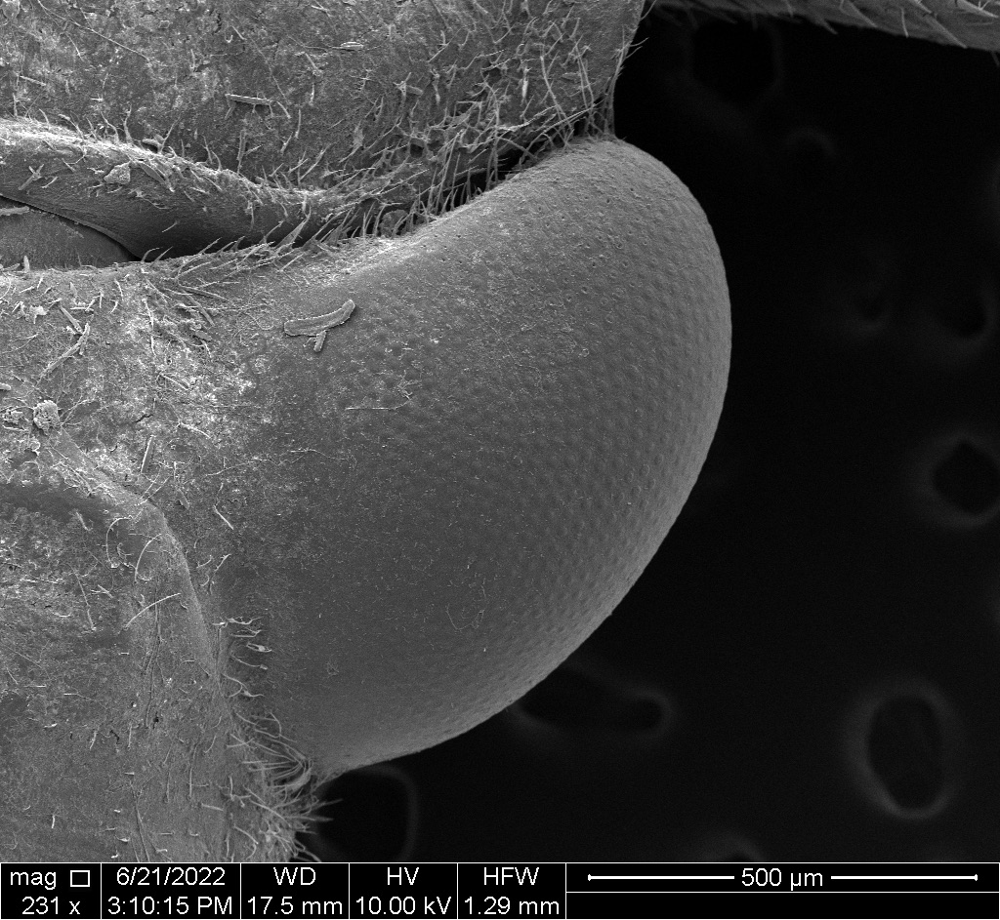

Hi Folks! My name is Tanner Mierow and I am currently a first year biology PhD student at the University of Tulsa!    

### Educational Experience  

Undergraduate Degree: Ecology, Evolution, and Behavior B.S., *summa cum laude*  
Thesis: Saccadic movement adjustments in Praying Mantids  
Advisor: Dr. Paloma Gonzalez-bellido  
Doctorate: Biology PhD, University of Tulsa  
Advisor: Dr. Alexandra C N Kingston  

### Research Interests  

Animals have to intake sensory information from their environment and use sensory systems to process and respond to these sensory stimuli. I am passionate in studying how animals use these sensory systems, primarily vision, to carry out essential ecological behaviors. Currently, I am studying: 1. Mutualistic snapping shrimp-goby behaviors and both the neural and ecological mechanisms that guide these behaviors
2. the neural circuitry and physiological adaptations of Belostomatid vision and its relationship to predation behaviors 3.Function of optics in both water and air amongst freshwater insects.  

  

## Tables  

| Date | Descriptive Name | Assignment Link |
| :-- | :-- | :-- |
| 09/01 | Homework 1 | [Assignment1](Assignments/Assignment-1.htm cechl) | 
| 09/08 | Homework 2 | (was this page, so no link)
| 09/12 | Homework 3 | [Assignment3](Assignments/Assignment3.html)
| 09/19 | Homework 4 | [Assignment4](Assignments/Assignment4.html)
| 09/26 | Homework 5 | [Assignment5](Assignments/Assignment5.html)
| 10/11 | Homework 6 | [Assignment6](Assignments/Assignment6.html)
| 10/18 | Homework 7 | [Assignment7](Assignments/Assignment-7.html)
| 10/24 | Seminar Lec| [SeminarLec](Assignments/AcuityViewLesson.html)

